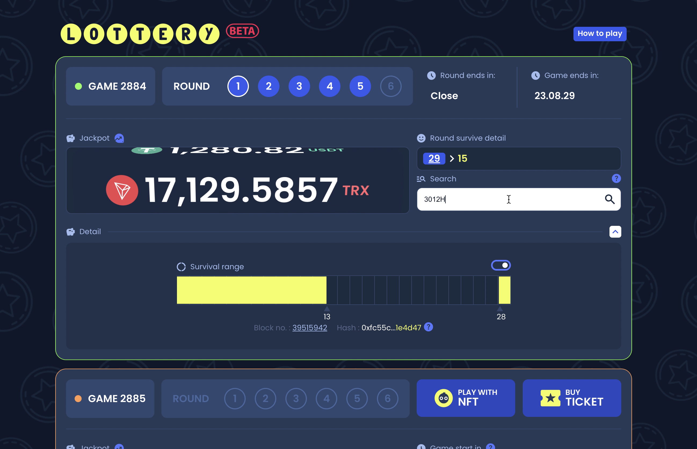
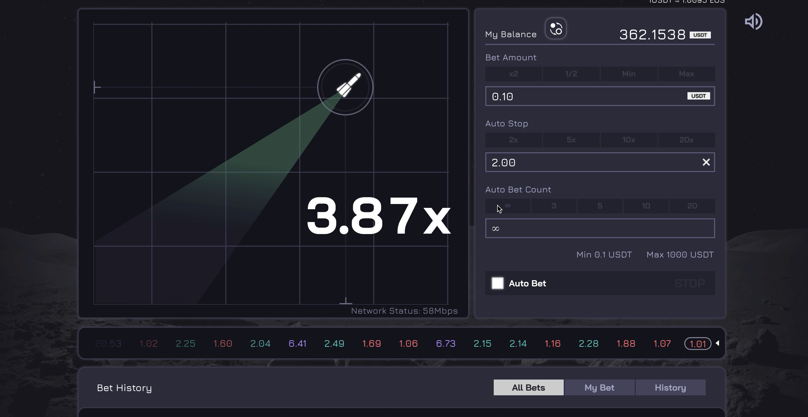
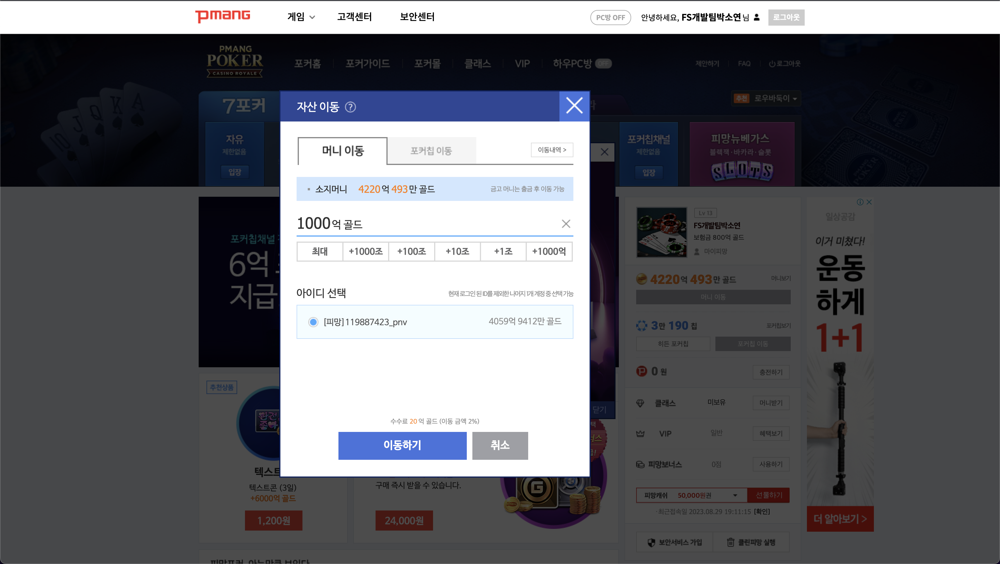

<!-- # FE 개발자, 박소연입니다 -->

안녕하세요. 풀스택 개발자로 성장중인 FE개발자 박소연입니다.  
여러 종류의 반응형 웹 사이트, 모바일 app 내 Web View UI, 웹 게임 등을 개발, 배포, 운영 경험이 있습니다.  
소통이 즐거운, 함께 일하고 싶은 개발자가 되고 싶습니다.

> 📫 contact : uyyu1734@gmail.com

 
<h2>🌱 Skills</h2>

  <h4> Language </h4>
  

  

  <h4>Framework & Library </h4>
  <a href="https://skillicons.dev">
    
    
    
    
    
     
    
    
  </a>

  

  <h4>Build</h4>
  

  <h4>Etc</h4>
  

 
<h2>🤩 Interests</h2>

 <h4>Tech</h4>
 <ul>
  <li>Web3와 BlockChain에 관심있습니다. </li>
  <li>Cloud computing과 이를 활용한 Serverless computing에 관심있습니다. </li>
 </ul>

 <h4>Hobby</h4>
 <ul>
  <li>여행🌴 - 국내외 여행다니는것을 좋아합니다. </li>
  <li>게임🥊 - PC, 보드게임 등 함께하는 게임을 즐깁니다.</li>
   <li>카페☕️ - 예쁜카페에 가서 코딩하는걸 즐깁니다. 함께 모각코해요!</li>
 </ul>

## 💻 Experience

- 프로디지털아카데미 | Cloud & Web Full Stack (2024.03 ~ )
- 네오위즈 | FE-Developr (2020.01 ~ 2023.08)
- SSAFY | Web Full Stack & 알고리즘 (2019.07 ~ 2019.12)
- 숙명여자대학교 | 소프트웨어학부 (2014.03 ~ 2019.08)

## ✒️ Certification

- 정보처리기사 (2019.12)
- 삼성 SW 역량테스트 A형 (2020.02)

## 📚 Projects

<link href="https://cdnjs.cloudflare.com/ajax/libs/github-markdown-css/5.1.0/github-markdown.css" rel="stylesheet"/>
    

      

        

          
        

      

      

        

          
        

      

      

        

          
        

      

      

        

          
        

      

      

        

          
        

      

      

        

          
        

      

      

        

          
        

      

      

        

          
        

      

    

[작업물](https://soyalattee.github.io/soyalattee/)

